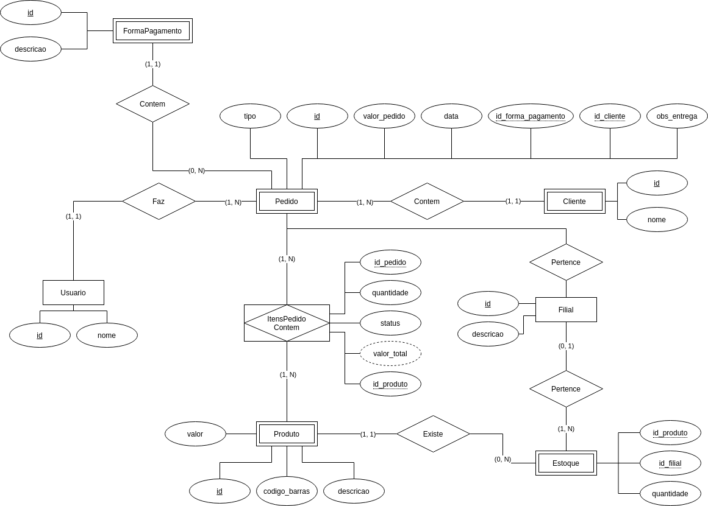
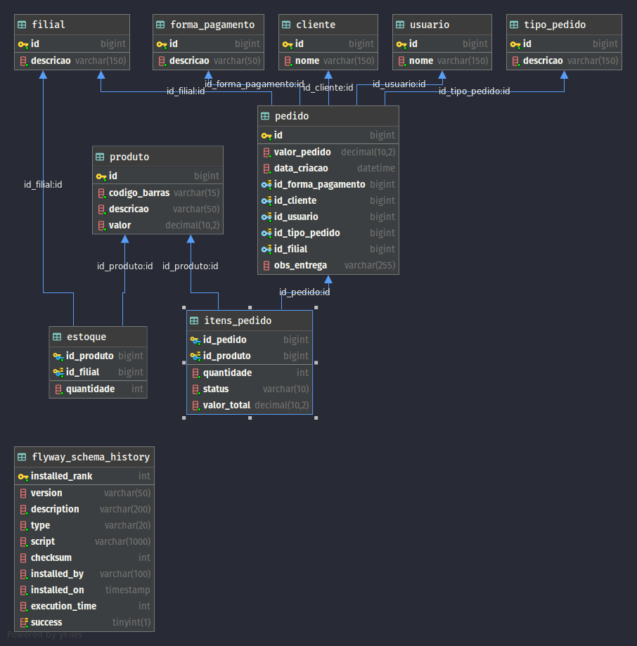

# Controle de estoque API
> Essa é uma API pública de gerenciamento de controler de estoque

## Banco de dados

Não será necessário criar as tabelas do banco de dados, as tabelas necessárias são migradas usando o Flyway.

## Credenciais

As credenciais do banco devem ser:

- usuário: root
- senha: admin

## Modelo relacional da base de dados

## Diagrama entidade relacionamento

